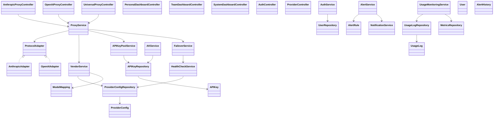
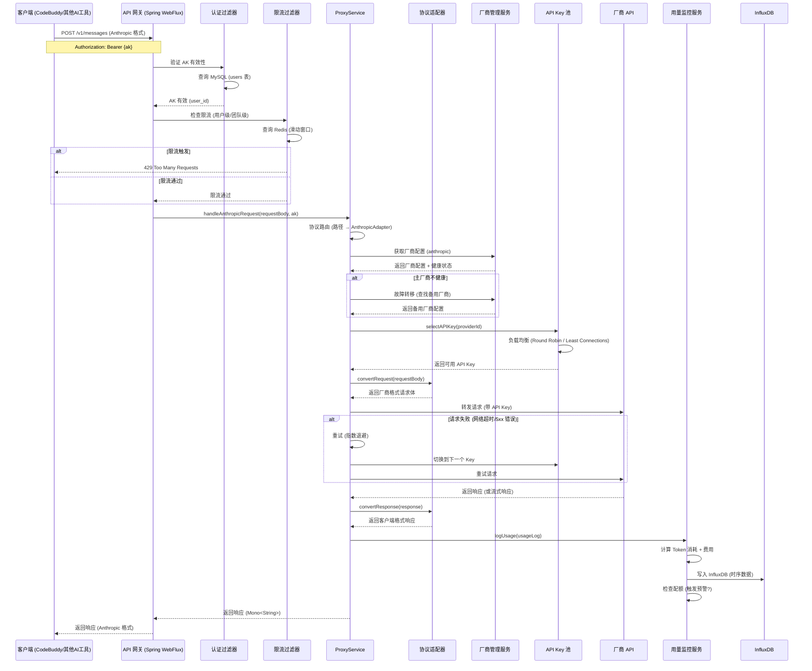

# 方舟 Code Plan 中转站系统 - 架构设计文档

**版本**: v1.0  
**日期**: 2026-05-11  
**作者**: 架构师 Agent  
**状态**: 待评审  
**对应 PRD**: prd-ark-code-plan-proxy-2026-05-11.md (v1.2)

---

## 目录

1. [技术选型与框架选型](#1-技术选型与框架选型)
2. [文件列表及相对路径](#2-文件列表及相对路径)
3. [数据结构和接口（类图）](#3-数据结构和接口类图)
4. [程序调用流程（时序图）](#4-程序调用流程时序图)
5. [任务列表（有序、含依赖关系）](#5-任务列表)
6. [依赖包列表](#6-依赖包列表)
7. [共享知识（跨文件约定）](#7-共享知识)
8. [待明确事项](#8-待明确事项)

---

## 1. 技术选型与框架选型

### 1.1 技术栈确认

基于 PRD 要求和 team-lead 确认，采用以下技术栈：

| 组件 | 技术 | 版本 | 选择理由 |
|------|------|------|---------|
| **后端框架** | Java Spring Boot (WebFlux) | 3.2+ | 响应式编程，高并发支持，非阻塞 I/O |
| **前端框架** | Vue 3 + TypeScript | 3.4+ | 响应式 UI，类型安全 |
| **UI 组件库** | Element Plus | 2.x | Vue 3 生态成熟，企业级组件 |
| **图表库** | ECharts | 5.x | 功能强大，支持实时更新 |
| **关系型数据库** | MySQL | 8.0+ | 成熟稳定，JSON 支持 |
| **时序数据库** | InfluxDB | 2.x | 时序数据优化，高压缩比 |
| **缓存** | Redis | 7+ | 高性能，丰富数据结构 |
| **部署** | Docker Compose | - | 快速部署，适合中小团队 |

### 1.2 技术选型对比

#### 后端框架对比

| 维度 | Spring Boot WebFlux (推荐) | Spring Boot MVC | Node.js (Express) |
|------|---------------------------|-----------------|-------------------|
| **并发模型** | 响应式 (Reactor) | 阻塞式 (Thread-per-request) | 事件驱动 (非阻塞) |
| **适用场景** | 高并发 I/O 密集型 | 传统 Web 应用 | 实时应用 |
| **性能** | ⭐⭐⭐⭐ (高并发) | ⭐⭐⭐ (中等) | ⭐⭐⭐⭐ (高并发) |
| **学习曲线** | ⭐⭐⭐ (中等) | ⭐⭐ (简单) | ⭐⭐ (简单) |
| **AI API 代理适配性** | ⭐⭐⭐⭐⭐ (流式响应支持好) | ⭐⭐⭐ (可用但占用线程多) | ⭐⭐⭐⭐ (流式响应支持好) |

**推荐理由**:
1. **响应式编程**: AI API 调用是 I/O 密集型，WebFlux 的非阻塞模型更适合
2. **流式响应支持**: SSE (Server-Sent Events) 和 WebSocket 支持好，适合 AI 流式输出
3. **生态成熟**: Spring 生态完善，集成 Redis/MySQL/InfluxDB 方便
4. **团队技能**: Java 团队更容易上手

---

## 2. 文件列表及相对路径

### 2.1 后端文件结构 (Spring Boot WebFlux)

```
src/main/java/com/ark/proxy/
├── ArkProxyApplication.java                     # 启动类
├── config/                                     # 配置类
│   ├── RedisConfig.java                        # Redis 配置
│   ├── InfluxDBConfig.java                    # InfluxDB 配置
│   ├── WebFluxConfig.java                     # WebFlux 配置 (CORS, 编解码器)
│   ├── RateLimitConfig.java                    # 限流配置
│   └── CircuitBreakerConfig.java             # 熔断配置
├── controller/                                 # 控制器层
│   ├── api/                                  # API 代理控制器
│   │   ├── AnthropicProxyController.java      # Anthropic Messages API 代理
│   │   ├── OpenAIProxyController.java         # OpenAI Chat Completions API 代理
│   │   └── UniversalProxyController.java     # 通用代理控制器
│   ├── dashboard/                             # 看板控制器
│   │   ├── PersonalDashboardController.java   # 个人看板 API
│   │   ├── TeamDashboardController.java       # 团队看板 API
│   │   └── SystemDashboardController.java     # 系统看板 API
│   ├── auth/                                 # 认证控制器
│   │   └── AuthController.java               # 登录、注册、Token 刷新
│   └── admin/                                # 管理控制器
│       ├── ProviderController.java             # 厂商管理 API
│       ├── AKController.java                  # AK 分配管理 API
│       └── AlertController.java              # 预警管理 API
├── service/                                   # 服务层
│   ├── proxy/                                # 代理服务
│   │   ├── ProxyService.java                  # 代理核心服务
│   │   ├── LoadBalancer.java                 # 负载均衡器
│   │   └── RetryService.java                 # 重试服务
│   ├── adapter/                              # 协议适配器
│   │   ├── ProtocolAdapter.java               # 适配器接口
│   │   ├── AnthropicAdapter.java             # Anthropic 适配器
│   │   ├── OpenAIAdapter.java                # OpenAI 适配器
│   │   ├── DeepSeekAdapter.java              # DeepSeek 适配器
│   │   ├── KimiAdapter.java                  # Kimi 适配器
│   │   └── ProtocolConverter.java            # 协议转换器
│   ├── vendor/                               # 厂商管理服务
│   │   ├── VendorService.java                # 厂商配置管理
│   │   ├── ModelMappingService.java          # 模型映射管理
│   │   ├── APIKeyPoolService.java           # API Key 池管理
│   │   ├── HealthCheckService.java           # 健康检查服务
│   │   └── FailoverService.java             # 故障转移服务
│   ├── auth/                                  # 认证服务
│   │   ├── AuthService.java                  # 认证核心服务
│   │   ├── TokenService.java                 # JWT Token 管理
│   │   └── AKService.java                   # AK 分配服务
│   ├── monitoring/                            # 监控服务
│   │   ├── UsageMonitoringService.java       # 用量监控服务
│   │   ├── MetricsCollector.java             # 指标采集器
│   │   ├── AlertService.java                 # 预警服务
│   │   └── DashboardService.java             # 看板数据服务
│   └── notification/                          # 通知服务
│       ├── NotificationService.java           # 通知核心服务
│       ├── EmailService.java                  # 邮件通知
│       ├── WeChatService.java                # 企业微信通知
│       └── WebhookService.java               # Webhook 通知
├── repository/                                # 数据访问层
│   ├── mysql/                               # MySQL 数据访问
│   │   ├── UserRepository.java
│   │   ├── UsageLogRepository.java
│   │   ├── DailyUsageSummaryRepository.java
│   │   ├── AlertRuleRepository.java
│   │   ├── AlertHistoryRepository.java
│   │   ├── ProviderConfigRepository.java
│   │   ├── ModelMappingRepository.java
│   │   └── APIKeyRepository.java
│   ├── influxdb/                            # InfluxDB 数据访问
│   │   ├── MetricsRepository.java
│   │   └── RealtimeMetricsRepository.java
│   └── redis/                               # Redis 数据访问
│       ├── CacheRepository.java
│       ├── RateLimitRepository.java
│       └── SessionRepository.java
├── model/                                     # 数据模型
│   ├── entity/                               # 实体类 (JPA)
│   │   ├── User.java
│   │   ├── UserQuota.java
│   │   ├── UsageLog.java
│   │   ├── DailyUsageSummary.java
│   │   ├── AlertRule.java
│   │   ├── AlertHistory.java
│   │   ├── ProviderConfig.java
│   │   ├── ModelMapping.java
│   │   └── APIKey.java
│   ├── dto/                                  # 数据传输对象
│   │   ├── request/                          # 请求 DTO
│   │   │   ├── LoginRequest.java
│   │   │   ├── AKApplyRequest.java
│   │   │   ├── AKApproveRequest.java
│   │   │   ├── ProviderCreateRequest.java
│   │   │   └── AlertRuleCreateRequest.java
│   │   ├── response/                         # 响应 DTO
│   │   │   ├── TokenResponse.java
│   │   │   ├── DashboardSummaryResponse.java
│   │   │   ├── UsageTrendResponse.java
│   │   │   └── AlertResponse.java
│   │   └── metrics/                          # 指标 DTO
│   │       ├── RealtimeMetrics.java
│   │       ├── UsageMetrics.java
│   │       └── SystemMetrics.java
│   └── enums/                               # 枚举类
│       ├── ProviderType.java
│       ├── ModelType.java
│       ├── AlertSeverity.java
│       └── AKStatus.java
├── exception/                                 # 异常处理
│   ├── GlobalExceptionHandler.java            # 全局异常处理器
│   ├── RateLimitException.java               # 限流异常
│   ├── VendorUnavailableException.java       # 厂商不可用异常
│   └── AKQuotaExceededException.java        # AK 配额超限异常
├── filter/                                    # 过滤器
│   ├── AuthenticationFilter.java              # 认证过滤器
│   ├── RateLimitFilter.java                  # 限流过滤器
│   └── LoggingFilter.java                   # 日志过滤器
├── handler/                                   # 处理器
│   ├── RateLimitHandler.java                 # 限流处理器 (WebFlux)
│   └── CircuitBreakerHandler.java          # 熔断处理器 (WebFlux)
└── util/                                      # 工具类
    ├── JwtUtil.java                          # JWT 工具类
    ├── EncryptUtil.java                      # 加密工具类 (AK/SK 加密)
    ├── RateLimitUtil.java                    # 限流工具类
    └── MetricsUtil.java                     # 指标工具类
```

---

## 3. 数据结构和接口（类图）

### 3.1 核心类图 (Mermaid)



### 3.2 关键接口定义

#### 3.2.1 ProtocolAdapter 接口 (多协议适配)

```java
/**
 * 协议适配器接口
 * 所有厂商适配器必须实现此接口
 */
public interface ProtocolAdapter {
    
    /**
     * 获取适配器类型
     */
    ProviderType getProviderType();
    
    /**
     * 转换请求格式 (客户端格式 → 厂商格式)
     * @param request 客户端请求体
     * @return 厂商 API 请求体
     */
    String convertRequest(String request);
    
    /**
     * 转换响应格式 (厂商格式 → 客户端格式)
     * @param response 厂商 API 响应体
     * @return 客户端响应体
     */
    String convertResponse(String response);
    
    /**
     * 处理流式响应 (SSE)
     * @param event 厂商 SSE 事件
     * @return 转换后的 SSE 事件
     */
    String convertStreamEvent(String event);
    
    /**
     * 统一错误处理
     * @param errorResponse 厂商错误响应
     * @return 统一错误格式
     */
    String handleError(String errorResponse);
}
```

---

## 4. 程序调用流程（时序图）

### 4.1 AI API 请求代理流程



---

## 5. 任务列表

### 5.1 任务依赖关系图

```
Phase 1 (MVP - 6-8 周)
├── Task 1: 项目初始化 + 数据库设计 (Week 1) [P0]
├── Task 2: 用户认证模块 (Week 1-2) [P0] (依赖 Task 1)
├── Task 3: AK 申请审批流程 (Week 2-3) [P0] (依赖 Task 2)
├── Task 4: Anthropic 协议适配器 (Week 3-4) [P0] (依赖 Task 1)
├── Task 5: OpenAI 协议适配器 (Week 4) [P0] (依赖 Task 4)
├── Task 6: API 网关核心功能 (Week 4-5) [P0] (依赖 Task 4, Task 5)
├── Task 7: 用量监控模块 (Week 5-6) [P0] (依赖 Task 6)
├── Task 8: 流量预警模块 (Week 6) [P0] (依赖 Task 7)
├── Task 9: 个人看板前端 (Week 5-6) [P0] (依赖 Task 2)
├── Task 10: 团队看板前端 (Week 6-7) [P1] (依赖 Task 9)
└── Task 11: 集成测试 + Bug 修复 (Week 7-8) [P0] (依赖所有前序任务)

Phase 2 (增强 - 4-6 周)
├── Task 12: DeepSeek 协议适配器 (Week 9) [P1] (依赖 Phase 1)
├── Task 13: Kimi 协议适配器 (Week 9-10) [P1] (依赖 Task 12)
├── Task 14: AK 自动轮换 (Week 10) [P2] (依赖 Task 3)
├── Task 15: AK 使用审计 (Week 10-11) [P2] (依赖 Task 14)
├── Task 16: 厂商管理后台 (Week 11) [P1] (依赖 Phase 1)
└── Task 17: 系统看板 + 管理功能 (Week 11-12) [P1] (依赖 Task 16)

Phase 3 (完善 - 4-6 周)
├── Task 18: MiniMax 协议适配器 (Week 13) [P2] (依赖 Phase 2)
├── Task 19: GLM 协议适配器 (Week 13) [P2] (依赖 Task 18)
├── Task 20: 新用户引导 (Week 14) [P2] (依赖 Phase 2)
├── Task 21: 一键申请入口 (Week 14) [P2] (依赖 Task 20)
├── Task 22: 使用案例库 (Week 15) [P2] (依赖 Task 20)
└── Task 23: 智能客服/AI 辅助排障 (Week 15-16) [P2] (依赖 Task 22)
```

---

## 6. 依赖包列表

### 6.1 后端依赖 (Maven pom.xml)

```xml
<!-- Spring Boot WebFlux (响应式 Web 框架) -->
<dependency>
    <groupId>org.springframework.boot</groupId>
    <artifactId>spring-boot-starter-webflux</artifactId>
</dependency>

<!-- Spring Data Redis (响应式 Redis 客户端) -->
<dependency>
    <groupId>org.springframework.boot</groupId>
    <artifactId>spring-boot-starter-data-redis-reactive</artifactId>
</dependency>

<!-- Lettuce (Redis 客户端, WebFlux 默认) -->
<dependency>
    <groupId>io.lettuce</groupId>
    <artifactId>lettuce-core</artifactId>
</dependency>

<!-- Spring Data JPA (MySQL 访问) -->
<dependency>
    <groupId>org.springframework.boot</groupId>
    <artifactId>spring-boot-starter-data-jpa</artifactId>
</dependency>

<!-- MySQL Connector -->
<dependency>
    <groupId>com.mysql</groupId>
    <artifactId>mysql-connector-j</artifactId>
    <scope>runtime</scope>
</dependency>

<!-- InfluxDB Java Client (时序数据库) -->
<dependency>
    <groupId>com.influxdb</groupId>
    <artifactId>influxdb-client-java</artifactId>
    <version>6.10.0</version>
</dependency>

<!-- JWT (认证) -->
<dependency>
    <groupId>io.jsonwebtoken</groupId>
    <artifactId>jjwt-api</artifactId>
    <version>0.11.5</version>
</dependency>
<dependency>
    <groupId>io.jsonwebtoken</groupId>
    <artifactId>jjwt-impl</artifactId>
    <version>0.11.5</version>
</dependency>
<dependency>
    <groupId>io.jsonwebtoken</groupId>
    <artifactId>jjwt-jackson</artifactId>
    <version>0.11.5</version>
</dependency>

<!-- Resilience4j (熔断、限流) -->
<dependency>
    <groupId>io.github.resilience4j</groupId>
    <artifactId>resilience4j-reactor</artifactId>
    <version>2.1.0</version>
</dependency>

<!-- Bucket4j (限流) -->
<dependency>
    <groupId>com.github.vladimir-bukhtoyarov</groupId>
    <artifactId>bucket4j-core</artifactId>
    <version>8.1.0</version>
</dependency>
<dependency>
    <groupId>com.github.vladimir-bukhtoyarov</groupId>
    <artifactId>bucket4j-redis</artifactId>
    <version>8.1.0</version>
</dependency>
```

---

## 7. 共享知识 (跨文件约定)

### 7.1 API 响应格式统一

**成功响应格式**:
```json
{
  "code": 200,
  "message": "success",
  "data": { ... },
  "timestamp": "2026-05-11T10:30:00Z",
  "request_id": "req_abc123"
}
```

**错误响应格式**:
```json
{
  "code": 400,
  "message": "Bad Request",
  "error": {
    "type": "invalid_request_error",
    "code": "AK_NOT_FOUND",
    "message": "AK 不存在或已失效",
    "param": null,
    "detail": "请检查 AK 是否正确，或重新申请 AK"
  },
  "timestamp": "2026-05-11T10:30:00Z",
  "request_id": "req_abc123"
}
```

### 7.2 安全防护约定

1. **AK/SK 加密存储**: 使用 AES-256-GCM 加密后存储到 MySQL
2. **密码哈希**: 使用 bcrypt (salt round=12) 哈希后存储
3. **JWT Secret**: 存储在环境变量，定期轮换
4. **SQL 注入防护**: 使用 JPA 的参数化查询，禁止字符串拼接 SQL
5. **XSS 防护**: 前端使用 Vue 的模板语法 (自动转义)，后端使用 OWASP ESAPI 转义
6. **限流**: 基于 Redis 的滑动窗口算法，防止暴力破解

---

## 8. 待明确事项

### 8.1 业务相关

| # | 待明确事项 | 影响范围 | 建议方案 |
|---|-----------|---------|---------|
| 1 | **方舟 API 的集成方式** | 厂商管理模块 | 需要对方舟 API 进行适配，建议先获取方舟 API 文档 |
| 2 | **部署方式 (私有化 vs SaaS)** | 系统架构、安全设计 | PRD 明确"不做多租户 SaaS"，建议私有化部署 |
| 3 | **身份认证方式 (独立账号 vs 企业统一认证)** | 用户认证模块 | 建议 Phase 1 使用独立账号，Phase 2 对接企业 LDAP/OAuth2 |
| 4 | **成本中心归属 (预算设置和审批流程)** | AK 分配模块、预警模块 | 建议 Phase 1 简化 (管理员手动设置)，Phase 2 对接财务系统 |
| 5 | **与现有系统的集成 (项目管理工具、CI/CD)** | 系统集成 | 建议 Phase 2 考虑，Phase 1 不包含 |

---

**文档版本历史**

| 版本 | 日期 | 作者 | 变更说明 |
|------|------|--------|----------|
| v1.0 | 2026-05-11 | 架构师 Agent | 初始版本 (基于 PRD v1.2) |

---

**文档结束**
